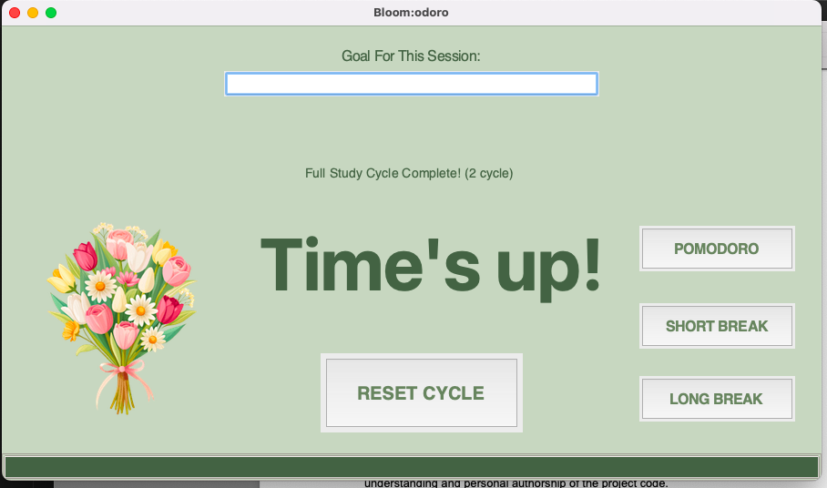

# Bloom:odoro — A Motivational Pomodoro Timer

Bloomodoro is an interactive productivity timer built in **Python** with **Tkinter**, designed to make studying and working feel rewarding through visual feedback; in turn increasing productivity.  
Each completed Pomodoro session helps your digital flower bloom — turning focus into growth.

## Table of Contents
- [General Information](#general-information)
- [Technologies Used](#technologies-used)
- [Features](#features)
- [Screenshots](#screenshots)
- [Setup](#setup)
- [Usage](#usage)
- [Development Journey](#development-journey)
- [Future Improvements](#future-improvements)
- [Learning Resources](#learning-resources)
- [Author](#author)

---

## General Information

**Bloom:odoro** reimagines the Pomodoro technique by integrating a **flower growth mechanic** that visually represents focus, consistency, and overall productivity.  
Each completed study session rewards users with a new stage of a growing flower, which eventually grows into a beautiful bouquet as a digital treat to congratulate  users for being productive.

The project was developed as a creative solution to a real problem that students in particular are facing, that being lack of motivation to complete studies and other everyday tasks. This prototype explores **interaction design**, **motivation visualisation**, and **UI logic**.
  
It uses soft, nature-inspired visuals to cultivate calm focus and a sense of achievement.

---

## Technologies Used

- **Python 3.12+**
- **Tkinter** — GUI interface
- **Threading** — Keeps timer and interface responsive
- **PIL (Pillow)** — Image handling for the flower growth stages
- **time** — Countdown logic
- **ttk** — For styled progress bar integration

---

## Features

**Pomodoro Timer Logic** — 25-minute work sessions, with 5- and 15-minute breaks.  
**Goal Input System** — Set a goal per session to stay intentional.  
**Flower Growth Mechanic** — Watch your flower evolve from a seed, to a sprout, the flower, and finally a bouquet as you complete work sessions.   
**Progress Tracking** — Displays “Cycle Progress: X/4 completed sessions”.  
**Progress Bar** — Smoothly fills as the timer counts down.  
**Cycle Reset** — Resets timer, flower, and goal after every four sessions.  
**Threading Integration** — Keeps the timer responsive while running.

---

## Screenshots



---

## Setup

To get Bloomodoro to run locally, follow these steps to ensure success:

1. Clone the repository and navigate to the prototype folder:

```bash
git clone https://github.com/alexysc207/Bloomodoro-A2-Code-Prototype.git
cd Bloomodoro-A2-Code-Prototype/Bloomodoro\ Prototype

2. Install Python 3.10+ if not already installed. Verify with:
python --version

3. Install required packages (Tkinter is included with Python):
pip install pillow

4. Ensure flower images (seed.png, sprout.png, flower.png, bouquet.png) are in the same folder as bloom_odoro.py.

5. Run the application:
python bloom_odoro.py

## Troubleshooting Tips:
GUI doesn’t appear → check Tkinter installation.

Images don’t show → verify file names/paths.

Timer freezes → ensure Pillow is installed and run script from the main thread.

---

## Usage

1. Launch the application.

2. Enter your focus goal for the session (it will print when the 'Start' Button is clicked).

3. Start the Pomodoro timer (default: 25 minutes).

4. Watch the progress bar fill as time passes.

5. When the timer finishes, your work session will be counted and your flower will grow to the next stage.

6. Select 'Short Break' or 'Long Break' buttons to enjoy some rest time before moving onto the next work session

7. After completing four work sessions, your flower fully blooms — and the cycle resets.

---

## Development Journey

After 6 weeks of coding, Project is: _complete_ for A2 prototype

| **Week** | **Focus** | **Key Achievements** |
|----------|-----------|----------------------|
| **Week 7** | Interface & Timer | Built the GUI in Tkinter, implemented core timer logic, and added start/pause button functionality |
| **Week 8** | Goals & Session Control | Added goal input fields, tweaked button layout, implemented session tracking, and refined pause/resume functionality |
| **Week 9** | Flower Mechanic | Developed flower growth stages, refined session count logic, and connected visual feedback to completed sessions |
| **Week 10** | Animation & Timing | Implemented morphing between flower stages, fixed timing for flower growth to match completed work sessions, and improved scaling/positioning |
| **Week 11** | Cycle Logic | Streamlined cycle completion logic, reset functionality, and refined interface behavior at the end of a full cycle |
| **Week 12** | Finalisation & Polish | Added progress bar, raised button effects, final bug fixes, layout adjustments, and completed testing for smooth user experience |

---

## Future Improvements

Bloomodoro is an application that has endless possibilities. Upon my completion of this project, there are still areas that have room for improvement, these being:

- Data saving using JSON files - being able to save session progress between launches of the application
- Add sound notifications for session transitions or when the flower grows
- Rain animation that triggers the flower growth
- Add ability to customise the theme of the application
- Add an analytics dashboard (track total focus hours per week)

---

## Learning Resources

### Tutorials & Video Guides
- [Neural Nine – Python Timer Tutorial](https://www.youtube.com/watch?v=FJeXp5yZd-g) — main inspiration for the timer and break button setup  
- [Madecraft Speaker – Python for Students](https://www.linkedin.com/learning/python-for-students/) — basics of coding using Python  
- [Anshuman Biswal – Add Pictures and Images to TKinter Application](https://youtu.be/pk8714VXBC0)  - used for my flower growth mechanic

### Tkinter References & GUI Guides
- [Real Python – Tkinter Buttons & Layout](https://realpython.com/python-gui-tkinter/#displaying-clickable-buttons-with-button-widgets)  
- [Python Official Documentation – Tkinter Concepts](https://docs.python.org/3/library/tkinter.html#important-tk-concepts)  
- [Python Tutorial – Tkinter Labels](https://www.pythontutorial.net/tkinter/tkinter-label/)  

### Image Handling & Animations
- [GeeksforGeeks – Python Pillow Tutorial](https://www.geeksforgeeks.org/python/python-pillow-tutorial/)  
- [GeeksforGeeks – Adding Images in Tkinter](https://www.geeksforgeeks.org/python/how-to-add-an-image-in-tkinter/)  
- [TutorialsPoint – Loading Images Using PIL](https://www.tutorialspoint.com/loading-images-in-tkinter-using-pil)  
- [PlainEnglish – Widget Animations in Tkinter](https://plainenglish.io/blog/guide-to-widget-animations-with-tkinter)  
- [Python for Beginners – Animations in Tkinter](https://www.pythonforbiginners.com/2025/06/create-animations-in-tkinter-python-gui.html)  
- [Tkinter.com – Animate Widgets Tutorial](https://tkinter.com/how-to-animate-widgets-python-tkinter-gui-tutorial-164/)  
- [StackOverflow – Fade In/Out Tkinter Frame](https://stackoverflow.com/questions/27806669/how-to-fade-in-out-on-a-tkinter-frame)  

### Progress Bar References
- [Python Docs – ttk Progressbar](https://docs.python.org/3/library/tkinter.ttk.html#tkinter.ttk.Progressbar)  
- [PythonAssets – Progress Bar in Tkinter](https://pythonassets.com/posts/progress-bar-in-tk-tkinter/)  
- [StackOverflow – Tkinter Progress Bar Example](https://stackoverflow.com/questions/33768577/tkinter-gui-with-progress-bar)  
- [PythonGuides – Tkinter Progress Bar Tutorial](https://pythonguides.com/python-tkinter-progress-bar/)  
- [PythonTutorial.net – Tkinter Progressbar](https://www.pythontutorial.net/tkinter/tkinter-progressbar/)  
- [DataCamp – Progress Bars in Python](https://www.datacamp.com/tutorial/progress-bars-in-python)  

### Additional Python Guides
- [Python for Engineers – Pomodoro Timer Example](https://www.pythonforengineers.in/2025/01/pomodoro-timer.html)
- [Beginner's Python Cheat Sheet](https://github.com/ehmatthes/pcc_3e/releases/download/v1.0.0/beginners_python_cheat_sheet_pcc_all.pdf)

---

## Author
Created by [Alexys Cambey] 
